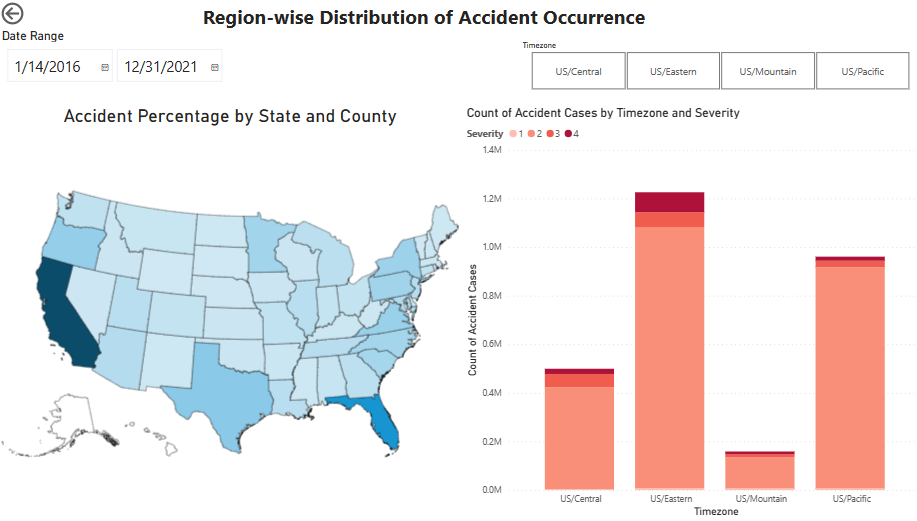

# USA Accidents Analysis
Analysis to extract insights that demonstrate the cause and effect principles to anticipate accidents and influence of environmental stimuli on accidents in the USA.

# Dataset
US-Accidents is a dataset on traffic accidents which includes data from all 49 states in the USA and contains over 2 million accident records from February 2016 to December 2021. This dataset has been collected in real-time using multiple traffic APIs. These APIs broadcast traffic events that have been recorded by numerous organisations, including the US Department of Transportation and individual state transportation departments, law enforcement organisations, traffic cameras, and traffic sensors embedded in the road networks.

It's a public dataset that's available [here](https://smoosavi.org/datasets/us_accidents).

# Dashboard Images
Finally, the derived insights were presented in a Power BI dashboard. Some images of the dashboard are as follows. 

